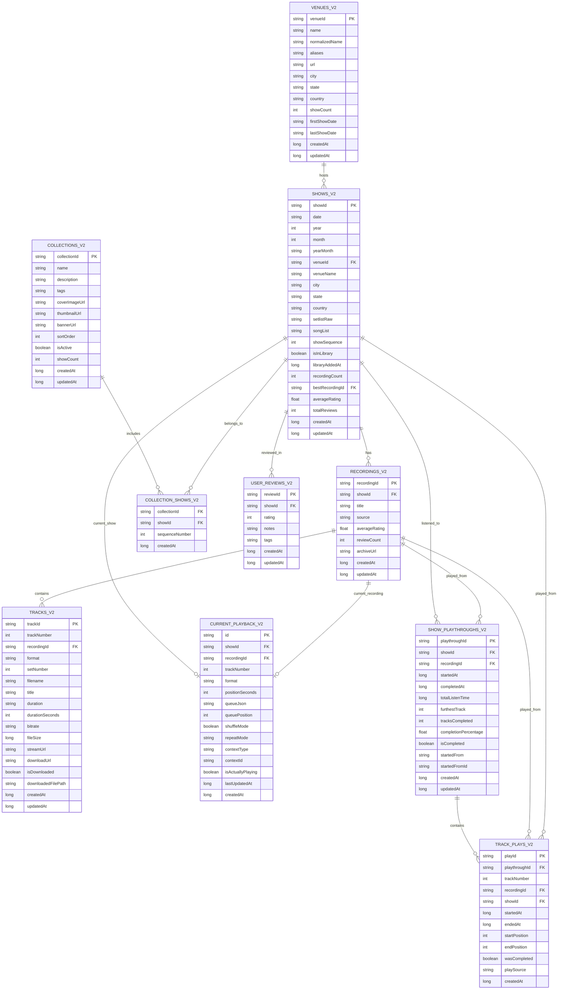

# V2 Database Schema Diagram

## Entity Relationship Diagram

## Key Relationships Summary

### Core Data Flow
1. **Venue** → hosts multiple **Shows**
2. **Show** → has multiple **Recordings** (different sources: SBD, AUD, etc.)
3. **Recording** → contains multiple **Tracks** (in different formats: MP3, FLAC, etc.)

### Collection System
4. **Collection** ← many-to-many → **Show** (via junction table)
5. Collections are pre-populated at build time from JSON definitions

### User Data
6. **Shows** → contain library status (isInLibrary, libraryAddedAt fields)
7. **User Reviews** → references **Shows** (ratings, notes, tags)
8. **Current Playback** → singleton state for resume functionality
9. **Show Playthrough** → analytics for each show listening session
10. **Track Play** → optional detailed tracking per track (linked to playthrough)

### Search & Performance Indices
- **Shows**: Indexed by year, yearMonth, date, city, state, venue, songList
- **Tracks**: Composite key (trackNumber + recordingId + format)
- **Collections**: Pre-computed show counts and relationships
- **User Activity**: Indexed by session, date, show for analytics

## Data Size Estimates
- **Shows**: ~2,300 shows (30+ years of Dead shows)
- **Recordings**: ~15,000 recordings (5-7 per show average)
- **Tracks**: ~2,000,000 tracks (multiple formats × ~130 tracks/recording average)
- **Collections**: ~100-200 curated collections
- **User Data**: Grows with usage (library, listening history)