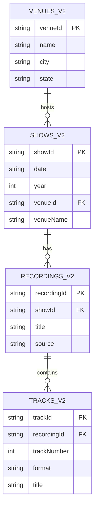

# Simple V2 Database Schema Test

```mermaid
erDiagram
    VENUES_V2 {
        string venueId PK
        string name
        string city
        string state
    }

    SHOWS_V2 {
        string showId PK
        string date
        int year
        string venueId FK
        string venueName
    }

    RECORDINGS_V2 {
        string recordingId PK
        string showId FK
        string title
        string source
    }

    TRACKS_V2 {
        string trackId PK
        string recordingId FK
        int trackNumber
        string format
        string title
    }

    VENUES_V2 ||--o{ SHOWS_V2 : hosts
    SHOWS_V2 ||--o{ RECORDINGS_V2 : has
    RECORDINGS_V2 ||--o{ TRACKS_V2 : contains
```