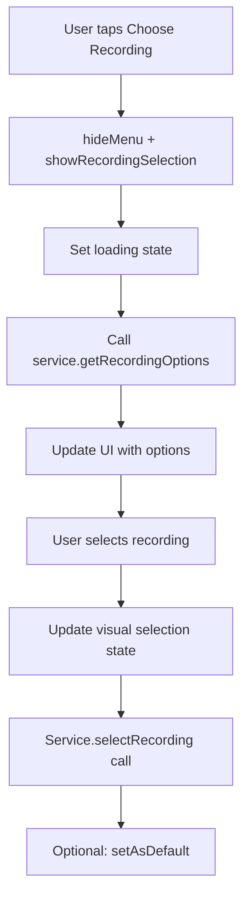

# PlaylistV2 Architecture

This document details the technical architecture of PlaylistV2, including component design, state management, service patterns, and data flow.

## V2 Architecture Principles

### UI-First Development
PlaylistV2 follows V2's UI-first development methodology:

1. **Component Implementation**: Build UI components first with mock data
2. **Service Interface Design**: Define service contracts based on UI requirements
3. **Stub Implementation**: Create comprehensive stubs with rich mock data
4. **Real Integration**: Connect to actual services when available

### View Model Pattern (UI-Specific)
V2 uses View Models as UI-specific data representations, not domain models:

```kotlin
// UI View Model - no V1 domain dependencies
data class RecordingOptionV2ViewModel(
    val identifier: String,
    val source: String,
    val title: String,
    val rating: Float?,
    val reviewCount: Int?,
    val isSelected: Boolean,
    val isRecommended: Boolean,
    val matchReason: String?
)
```

**Benefits**:
- No coupling to V1 domain models
- UI-optimized data structures
- Easy testing and mocking
- Clean separation of concerns

## Component Architecture

### Screen-Level Structure

```
PlaylistV2Screen (Coordinator)
├── Box (main container)
│   ├── PlaylistV2Header (overlay)
│   ├── LazyColumn (scrollable content)
│   │   ├── PlaylistV2AlbumArt
│   │   ├── PlaylistV2ShowInfo
│   │   ├── PlaylistV2InteractiveRating
│   │   ├── PlaylistV2ActionRow
│   │   └── PlaylistV2TrackList
│   └── DebugActivator (overlay, conditional)
└── Modals (conditional display)
    ├── PlaylistV2ReviewDetailsSheet
    ├── PlaylistV2MenuSheet
    └── PlaylistV2RecordingSelectionSheet
```

### Component Responsibilities

#### PlaylistV2Screen
**Role**: Screen coordinator and modal container
**Responsibilities**:
- State observation and propagation
- Modal lifecycle management
- Navigation integration
- Debug panel activation

#### PlaylistV2Header
**Role**: Navigation and branding
**Responsibilities**:
- Back button functionality
- Screen identification
- Overlay positioning

#### PlaylistV2AlbumArt
**Role**: Visual identity
**Responsibilities**:
- Album artwork display
- Consistent sizing (220dp)
- Loading state handling

#### PlaylistV2ShowInfo
**Role**: Concert information display
**Responsibilities**:
- Show metadata presentation
- Navigation controls (previous/next show)
- Loading state management
- Date and venue formatting

#### PlaylistV2InteractiveRating
**Role**: Rating display and review access
**Responsibilities**:
- Rating visualization with stars
- Review count display
- Clickable area management (rating card only)
- Review modal triggering

#### PlaylistV2ActionRow
**Role**: Primary action controls
**Responsibilities**:
- Library button integration
- Download button integration
- Setlist access
- Menu trigger
- Main play/pause control

#### PlaylistV2TrackList
**Role**: Track listing and playback
**Responsibilities**:
- Track list rendering
- Individual track play controls
- Download state display
- Current track highlighting

## State Management Architecture

### PlaylistV2UiState Structure

```kotlin
data class PlaylistV2UiState(
    // Core data
    val showData: PlaylistShowViewModel?,
    val trackData: List<PlaylistTrackViewModel>,
    
    // Playback state
    val currentTrackIndex: Int,
    val isPlaying: Boolean,
    
    // Loading states
    val isLoading: Boolean,
    val isNavigationLoading: Boolean,
    val error: String?,
    
    // Library state
    val isInLibrary: Boolean,
    
    // Modal states
    val showReviewDetails: Boolean,
    val reviewsLoading: Boolean,
    val reviews: List<Review>,
    val ratingDistribution: Map<Int, Int>,
    val reviewsError: String?,
    
    // Menu system
    val showMenu: Boolean,
    val recordingSelection: RecordingSelectionV2State
)
```

### State Flow Patterns

#### Single Source of Truth
All UI state flows through the single PlaylistV2UiState:

```kotlin
private val _uiState = MutableStateFlow(PlaylistV2UiState())
val uiState: StateFlow<PlaylistV2UiState> = _uiState.asStateFlow()
```

#### State Updates
State updates follow immutable copy patterns:

```kotlin
fun showReviews() {
    _uiState.value = _uiState.value.copy(showReviewDetails = true)
    loadReviews()
}
```

#### Nested State Management
Complex state like recording selection uses nested state objects:

```kotlin
val recordingSelection: RecordingSelectionV2State = RecordingSelectionV2State()
```

## Service Architecture

### PlaylistV2Service Interface

Clean service interface following single responsibility:

```kotlin
interface PlaylistV2Service {
    // Core functionality
    suspend fun loadShow(showId: String?)
    suspend fun getCurrentShowInfo(): PlaylistShowViewModel?
    suspend fun getTrackList(): List<PlaylistTrackViewModel>
    
    // Playback control
    suspend fun playTrack(trackIndex: Int)
    suspend fun pause()
    suspend fun resume()
    
    // Navigation
    suspend fun navigateToPreviousShow()
    suspend fun navigateToNextShow()
    
    // Library management
    suspend fun addToLibrary()
    
    // Downloads
    suspend fun downloadShow()
    
    // Sharing
    suspend fun shareShow()
    
    // Content access
    suspend fun loadSetlist()
    
    // Reviews
    suspend fun getCurrentReviews(): List<Review>
    suspend fun getRatingDistribution(): Map<Int, Int>
    
    // Recording selection
    suspend fun getRecordingOptions(): RecordingOptionsV2Result
    suspend fun selectRecording(recordingId: String)
    suspend fun setRecordingAsDefault(recordingId: String)
    suspend fun resetToRecommended()
}
```

### Service Implementation Pattern

#### Stub-First Development
PlaylistV2ServiceStub provides comprehensive mock implementation:

```kotlin
@Singleton
class PlaylistV2ServiceStub @Inject constructor() : PlaylistV2Service {
    
    override suspend fun getRecordingOptions(): RecordingOptionsV2Result {
        kotlinx.coroutines.delay(600) // Realistic loading simulation
        
        return RecordingOptionsV2Result(
            currentRecording = createMockCurrentRecording(),
            alternativeRecordings = createMockAlternatives(),
            hasRecommended = true
        )
    }
    
    private fun createMockCurrentRecording() = 
        RecordingOptionV2ViewModel(/* realistic Cornell '77 data */)
}
```

#### Benefits of Stub-First
- **Immediate Functionality**: All features work from day one
- **Rich Testing**: Comprehensive mock data enables thorough testing
- **UI Development**: Frontend development independent of backend
- **Integration Readiness**: Clear interfaces for real implementation

## Modal System Architecture

### Modal State Management

Each modal has dedicated state management:

```kotlin
// Review modal
val showReviewDetails: Boolean
val reviewsLoading: Boolean
val reviews: List<Review>

// Menu modal
val showMenu: Boolean

// Recording selection modal  
val recordingSelection: RecordingSelectionV2State
```

### Modal Component Pattern

All modals follow consistent patterns:

```kotlin
@Composable
fun PlaylistV2Modal(
    state: ModalState,              // Dedicated state object
    onAction: (ActionType) -> Unit, // Action callbacks
    onDismiss: () -> Unit,          // Dismissal handling
    modifier: Modifier = Modifier   // Styling customization
)
```

### Modal Integration

Modals integrate at screen level with conditional rendering:

```kotlin
// In PlaylistV2Screen
if (uiState.recordingSelection.isVisible) {
    PlaylistV2RecordingSelectionSheet(
        state = uiState.recordingSelection,
        onRecordingSelected = viewModel::selectRecording,
        onDismiss = viewModel::hideRecordingSelection
    )
}
```

## Recording Selection Architecture

### Multi-Layer State System

Recording selection uses sophisticated state management:

#### RecordingSelectionV2State (UI State)
```kotlin
data class RecordingSelectionV2State(
    val isVisible: Boolean,           // Modal visibility
    val showTitle: String,            // Context display
    val currentRecording: RecordingOptionV2ViewModel?,
    val alternativeRecordings: List<RecordingOptionV2ViewModel>,
    val hasRecommended: Boolean,      // Action button logic
    val isLoading: Boolean,           // Loading states
    val errorMessage: String?         // Error handling
)
```

#### RecordingOptionsV2Result (Service Result)
```kotlin
data class RecordingOptionsV2Result(
    val currentRecording: RecordingOptionV2ViewModel?,
    val alternativeRecordings: List<RecordingOptionV2ViewModel>,
    val hasRecommended: Boolean
)
```

### Selection Flow Architecture



### Visual State Management

Recording cards use tri-state visual feedback:

```kotlin
colors = CardDefaults.cardColors(
    containerColor = when {
        recordingOption.isSelected -> MaterialTheme.colorScheme.primaryContainer
        recordingOption.isRecommended -> MaterialTheme.colorScheme.tertiaryContainer
        else -> MaterialTheme.colorScheme.surface
    }
)
```

## Data Flow Patterns

### Unidirectional Data Flow

```
Service → ViewModel → UiState → UI Components → User Actions → ViewModel → Service
```

### Action Handling Pattern

All user actions flow through ViewModel methods:

```kotlin
// UI Component
onClick = viewModel::selectRecording

// ViewModel  
fun selectRecording(recordingId: String) {
    viewModelScope.launch {
        // Update UI state immediately
        updateSelectionState(recordingId)
        
        // Call service for persistence
        playlistV2Service.selectRecording(recordingId)
    }
}
```

### Error Handling Strategy

Consistent error handling across all operations:

```kotlin
viewModelScope.launch {
    try {
        _uiState.value = _uiState.value.copy(isLoading = true, error = null)
        val result = service.performOperation()
        _uiState.value = _uiState.value.copy(isLoading = false, data = result)
    } catch (e: Exception) {
        _uiState.value = _uiState.value.copy(
            isLoading = false, 
            error = "Operation failed: ${e.message}"
        )
    }
}
```

## Testing Architecture

### Component Testing Strategy

Each component can be tested in isolation:

```kotlin
@Test
fun testRecordingOptionCard_selectedState() {
    val selectedOption = RecordingOptionV2ViewModel(
        /* test data with isSelected = true */
    )
    
    composeTestRule.setContent {
        PlaylistV2RecordingOptionCard(
            recordingOption = selectedOption,
            onClick = { }
        )
    }
    
    // Verify selection visual state
    composeTestRule
        .onNodeWithContentDescription("Selected")
        .assertExists()
}
```

### ViewModel Testing

State transitions easily testable:

```kotlin
@Test
fun testShowRecordingSelection_loadsOptions() = runTest {
    viewModel.showRecordingSelection()
    
    val state = viewModel.uiState.value.recordingSelection
    assertTrue(state.isVisible)
    assertEquals(4, state.alternativeRecordings.size)
}
```

### Mock Data Testing

Rich stub data enables comprehensive testing:

```kotlin
val mockCornellRecordings = listOf(
    RecordingOptionV2ViewModel(/* Miller SBD */),
    RecordingOptionV2ViewModel(/* Bershaw AUD */),
    RecordingOptionV2ViewModel(/* Seamons MTX */)
)
```

## Performance Considerations

### Lazy Loading
- Recording options loaded only when modal opened
- Reviews loaded only when review modal opened
- Track list loaded only for current show

### State Efficiency  
- Single StateFlow source minimizes recomposition
- Focused state updates through copy operations
- Component isolation prevents unnecessary updates

### Memory Management
- Automatic Compose component disposal
- Proper ViewModel cleanup in onCleared()
- Modal state reset on dismissal

## Future Architecture Evolution

### V2 Domain Model Integration

When V2 domain models become available:

```kotlin
// Current: UI View Models
RecordingOptionV2ViewModel

// Future: Domain Model Integration  
fun RecordingV2Domain.toUIViewModel(): RecordingOptionV2ViewModel
```

### Service Implementation
```kotlin
// Current: Stub services
PlaylistV2ServiceStub

// Future: Real implementations
PlaylistV2ServiceImpl(
    archiveRepository: ArchiveV2Repository,
    mediaController: MediaV2Controller,
    userPreferences: PreferencesV2Repository
)
```

### Component Evolution
Components remain stable; only data sources change:

```kotlin
// UI components unchanged
PlaylistV2RecordingOptionCard(recordingOption: RecordingOptionV2ViewModel)

// Only data source changes
viewModel.getRecordingOptions() // Now calls real service instead of stub
```

## Conclusion

PlaylistV2's architecture demonstrates the power of clean V2 patterns:
- **Component Isolation**: Each piece has single responsibility
- **State Clarity**: Unidirectional data flow with clear state management  
- **Testing Excellence**: Comprehensive testability through stubs and isolation
- **Future-Proof**: Ready for real service integration without architectural changes

The architecture provides a solid foundation for current functionality while remaining flexible for future enhancements and V2 domain model integration.